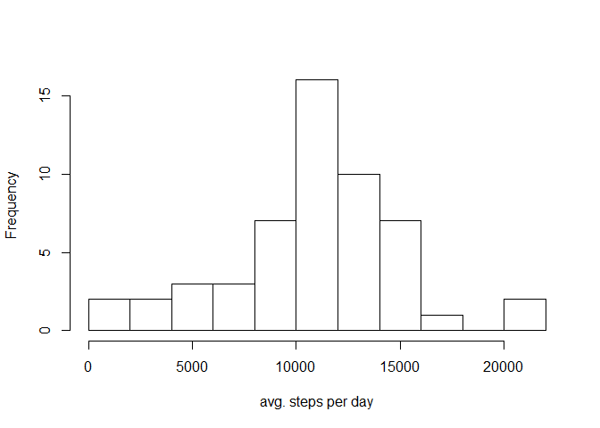
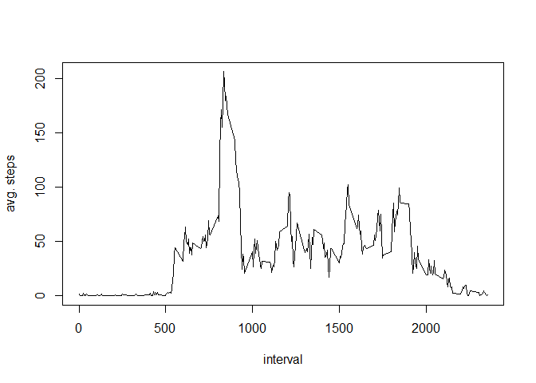
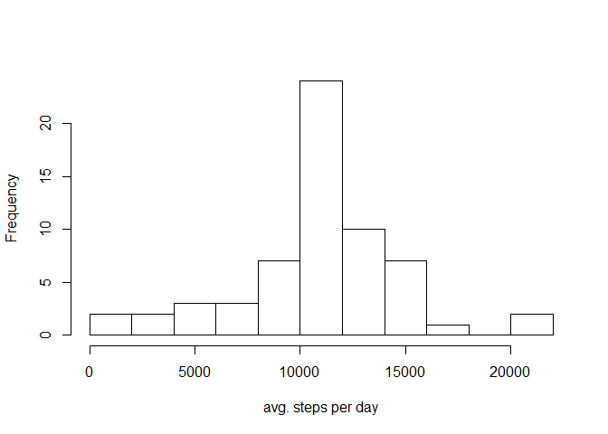
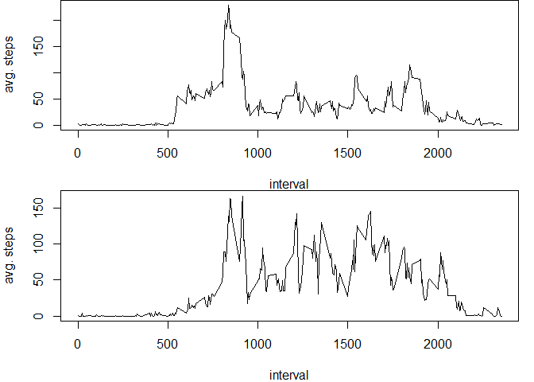

# Reproducible Research: Peer Assessment 1


## Loading and preprocessing the data


```r
setwd("C:/Chris/cds/repdata/RepData_PeerAssessment1")
raw <- read.csv("activity/activity.csv")
```


## What is the mean total number of steps taken per day?

First a subset of the data, which will not contain the NAs, has to be created.


```r
no_na <- raw[!is.na(raw$steps),]
```

Next plot the histogram and calculate the means of the total number of steps 
taken per day.

```r
sums1 <- tapply(no_na$steps, no_na$date, sum)
hist(sums1, breaks = 10, main = "", xlab = "avg. steps per day")
```

 

```r
mean(sums1, na.rm = T)
```

```
## [1] 10766.19
```

```r
median(sums1, na.rm = T)
```

```
## [1] 10765
```

## What is the average daily activity pattern?

First calculate the mean for every interval, reusing the no_na subset of the 
data. Afterwards plot the average daily pattern.


```r
means1 <- tapply(no_na$steps, no_na$interval, mean)
plot(x = names(means1), y = means1, type = "l", xlab = "interval", 
     ylab = "avg. steps")
```

 

Afterwards identify the interval with the maximum average number of steps.

```r
which(means1==max(means1))
```

```
## 835 
## 104
```

The interval 835, representing 8:35am, is when on average the most steps happen.

## Imputing missing values


First calculate the number of rows in the original data that had NAs.

```r
nrow(raw[is.na(raw$steps),])
```

```
## [1] 2304
```

As a second step replace the NA values with the mean number of steps for each
interval.


```r
filled_na <- raw
for(obs in 1:nrow(filled_na)) {
    if(is.na(filled_na[obs, 1])) {
        filled_na[obs, 1] <- as.numeric(means1[rownames(means1)==filled_na[obs, 3]])
        }
}
```

Afterwards create another histograms and calculate the mean/median for this new
dataset again.


```r
sums2 <- tapply(filled_na$steps, filled_na$date, sum)
hist(sums2, breaks = 10, main = "", xlab = "avg. steps per day")
```

 

```r
mean(sums2, na.rm = T)
```

```
## [1] 10766.19
```

```r
median(sums2, na.rm = T)
```

```
## [1] 10766.19
```

The histogram and the mean are not different from the ones based on the dataset
with the missing values. However the median is not equal to the mean.  
All of these effects can be explained by the fact that initially NAs only
occured either for the whole day or not at all. By replacing the values for all
intervals of a day with the average values, the mean would not change. Also 
because many more average days were introduced this made it very likely that
the median would become equal to the mean.


## Are there differences in activity patterns between weekdays and weekends?

First add a day type variable to the dataset, that indicated whether a given 
day is a weekday or a weekend day.


```r
filled_na2 <- filled_na
filled_na2$day_type <- weekdays(as.Date(filled_na$date, format = "%Y-%m-%d"))
for(obs in 1:nrow(filled_na2)) {
    if(filled_na2[obs, 4] == "Sunday" | filled_na2[obs, 4] == "Saturday") {
        filled_na2[obs, 4] <- "weekend"
        }
    if(filled_na2[obs, 4] == "Monday" | filled_na2[obs, 4] == "Tuesday" | 
           filled_na2[obs, 4] == "Wednesday" | filled_na2[obs, 4] == "Thursday" | 
           filled_na2[obs, 4] == "Friday") {
        filled_na2[obs, 4] <- "weekday"
        }
}
```

Afterwards plot the average number of steps taken in each interval, seperately 
for weekdays and weekend days

```r
par(mfrow = c(2,1), mar = c(4,4,0,1))
weekday <- filled_na2[filled_na2$day_type == "weekday",]
means_weekday <- tapply(weekday$steps, weekday$interval, mean)
plot(x = names(means_weekday), y = means_weekday, type = "l", xlab = "interval", 
     ylab = "avg. steps")
weekend <- filled_na2[filled_na2$day_type == "weekend",]
means_weekend <- tapply(weekend$steps, weekend$interval, mean)
plot(x = names(means_weekend), y = means_weekend, type = "l", xlab = "interval", 
     ylab = "avg. steps")
```

 
